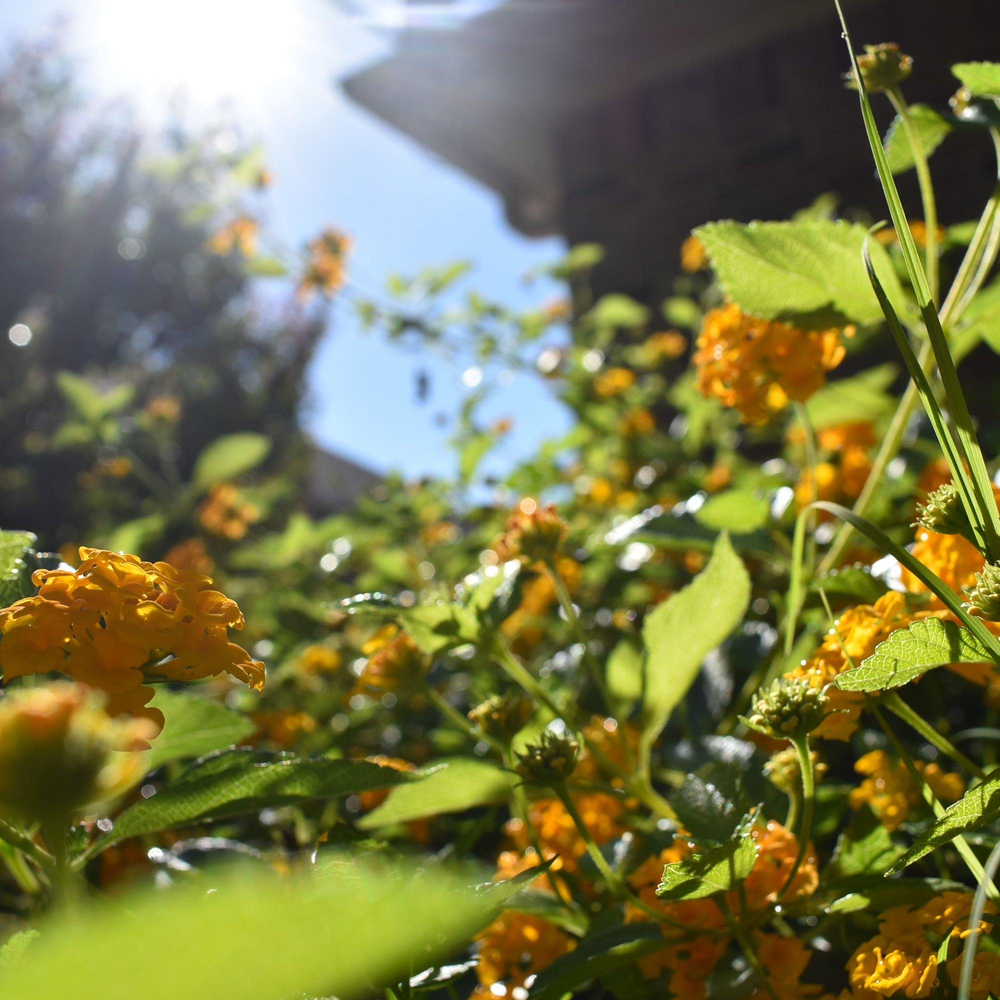
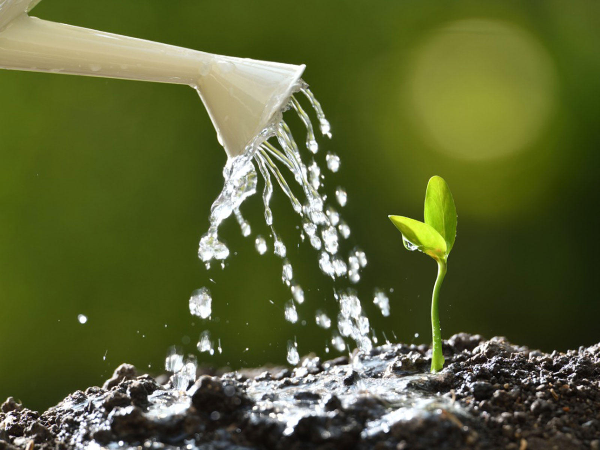

##How to grow a plant

**Background**

Growing plants requires patience, preseverence, and virtue. It is a very difficult task only manageable by few individuals. Not everyone is born with a "green thumb". However, with the use of this website, practically anyone will be able to grow a flower plant, as long as you follow these exact steps. 

**Instructions**

Firstly, you would need to gather all the necessary items to ensure that your plant grows well. Clear out a good patch of soil where it will receive a good amount of sunlight. Have the flower seed ready, along with a watering can full of water. Using a shovel, dig into the ground a few inches. Place the seed into this hole, and cover it back up with the discplaced dirt. Water the seed using the watering can and let it be. 

Remember to water the seed everyday and allow it to have plenty of sunlight. Make sure to tend to the plant daily, and pull out any weeds that you see. Weeds are very harmful to the growth of plants, since they steal nutrients from the plant. In a few days (approximately a week) a sapling should start to grow out from the seed.

Depending on the type of plant, it should take anywhere from 2 weeks to 2 months for it to fully grow. Once the plant grows, enjoy the scent of fresh flowers!

In the small chance that the flower plant does not grow, simply place another seed in the ground and repeat the steps mentioned above. If necessary, buy fertilizer and mix it in with the soil. It will help the plant grow even better, even if the soil conditions are bad.

Here is another link that you could use if you want more information on growing a plant:

[Alternate Website!](https://www.natria.com/learn/rose-flower/10-steps-growing-plants-seed)
